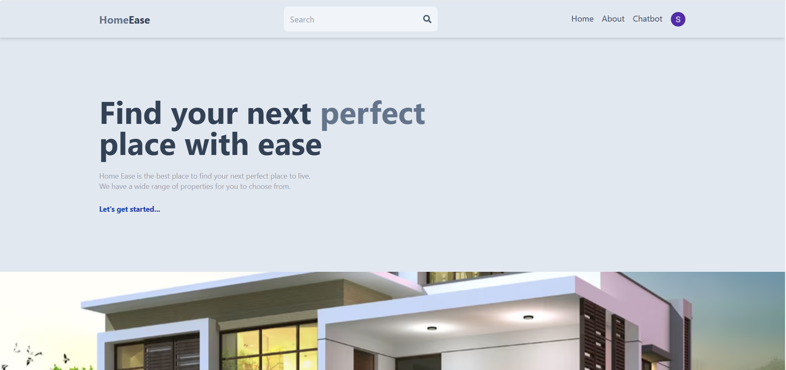
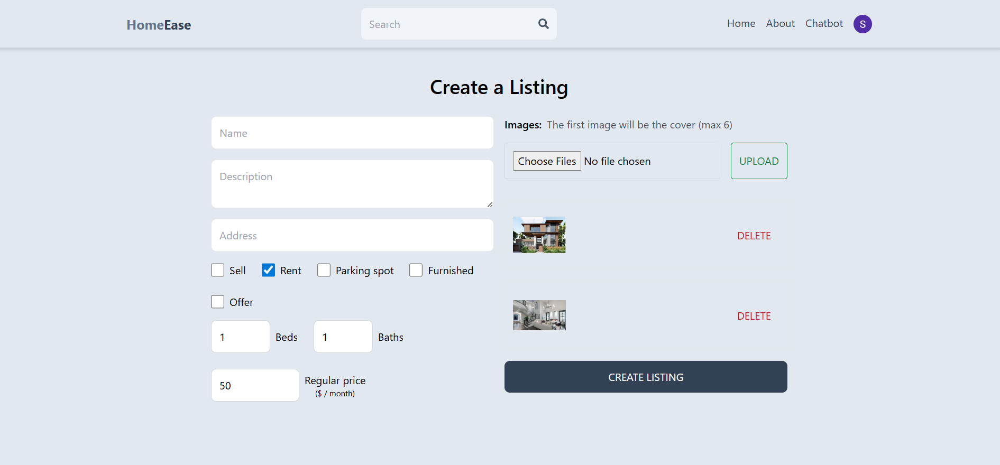
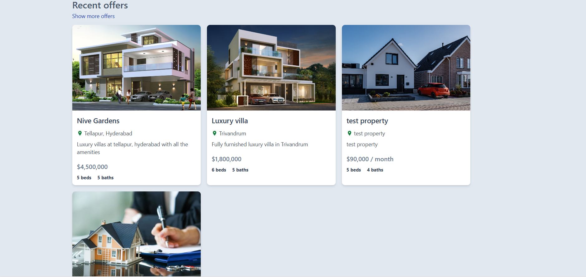

# 🏠 RealEstateConnect

**A full‑stack real estate platform to browse, list, and manage properties—complete with user auth and contextual chatbot support.**

[](https://reactjs.org/)  
[](https://nodejs.org/)  
[](https://expressjs.com/)  
[](https://www.mongodb.com/)  
[](https://www.python.org/)  

## 📸 Screenshots

<div align="center">
  
  
  
  
</div>

## ✨ Features

- 🔐 **User Auth** – Register, login, profile  
- 🏘️ **Listings** – Create, edit, delete posts  
- 🔍 **Search & Filter** – By location, price, type  
- 💬 **Contact Owners** – In‑app messaging  
- 🤖 **Chatbot** – Contextual Python support  
- 📱 **Responsive** – Desktop & mobile ready  

## 🚀 Quick Start

```bash
# 1. Clone the repo
git clone https://github.com/yourusername/RealEstateConnect.git
cd RealEstateConnect

# 2. Frontend (React)
cd client
npm install
npm start &

# 3. Backend (Node/Express)
cd ../api
npm install
# create a .env file with MONGO_URI and JWT_SECRET
npm start &

# 4. Chatbot (Python/Flask)
cd ../contextual-chatbot
pip install -r requirements.txt
python app.py

# 5. Open the app
# Frontend: http://localhost:3000
# API:      http://localhost:5000
# Chatbot: see port in app.py
